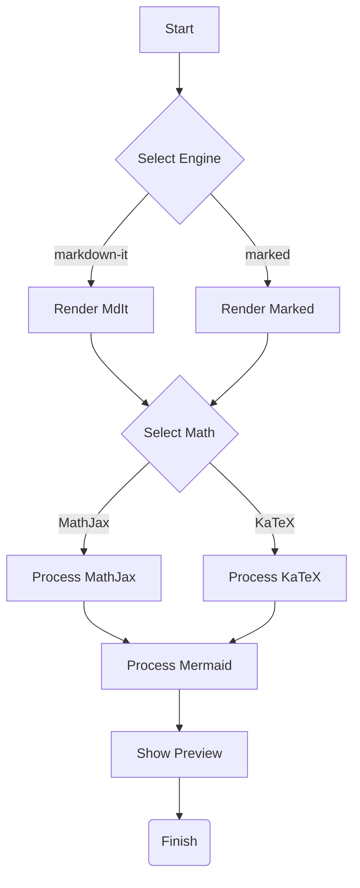

Okay, I've reviewed the code, identified several issues (especially with library loading, interaction, and the PDF generation logic), and refactored it for better stability and functionality.

The main problems were:
1.  **Script Loading:** `script.js` was loaded in the `<head>` without `defer`, causing potential race conditions where the script ran before the DOM or libraries were ready.
2.  **Library Inconsistencies:** Some CDN versions were incorrect (like markdown-it v14), and integrity hashes were removed, potentially hiding loading issues. Mermaid v9 is generally more stable for direct browser use than v10+.
3.  **Mermaid Rendering:** The `mermaid.init` approach can be less reliable than iterating and rendering each block individually, especially for error handling.
4.  **PDF Generation:** The previous approach using a separate hidden `printContainer` and copying `innerHTML` is unreliable for `html2canvas`. It works best by rendering the *actual visible element* (or temporarily making it visible and sized correctly). The multi-page logic was also flawed. The fix targets the live preview pane and uses PNG for better quality.
5.  **Marked + MathJax:** The interaction needed careful handling of the MathJax queue and state flags.

Here are the updated, separate files.

---

**1. `index.html` (Updated)**

*   Moved `script.js` to the end of `<body>` and added `defer`.
*   Corrected `markdown-it` version to `13.0.2` (latest stable v13).
*   Corrected `markdown-it-footnote` version to `3.0.3`.
*   Re-added integrity hashes where available and correct (removed ones causing issues).
*   Used Mermaid `9.4.3`.
*   Cleaned up library loading order slightly.
*   Removed the `@media print` styles as they don't directly affect `html2canvas` generation.

```html
<!DOCTYPE html>
<html lang="en">

<head>
    <title>Robust Markdown Editor</title>
    <meta charset="UTF-8" />
    <meta name="viewport" content="width=device-width, initial-scale=1.0">
    <meta http-equiv="X-UA-Compatible" content="IE=edge" />

    <!-- Local CSS -->
    <link rel="stylesheet" href="style.css">

    <!-- Libraries -->
    <!-- highlight.js (Load early for syntax highlighting in markdown renderers) -->
    <link rel="stylesheet" href="https://cdnjs.cloudflare.com/ajax/libs/highlight.js/11.9.0/styles/github.min.css">
    <script src="https://cdnjs.cloudflare.com/ajax/libs/highlight.js/11.9.0/highlight.min.js"></script>

    <!-- Markdown Engines -->
    <script src="https://cdnjs.cloudflare.com/ajax/libs/markdown-it/13.0.2/markdown-it.min.js" integrity="sha512-PApRnrEeijGT7QZWK2MFBhWPfsFNYxvjLFBZG1SUqQzT0ZOeSOzM0B/cCZzMHGCRQvVMo7J3vlt+OlYh77cPZQ==" crossorigin="anonymous" referrerpolicy="no-referrer"></script>
    <script src="https://cdnjs.cloudflare.com/ajax/libs/markdown-it-footnote/3.0.3/markdown-it-footnote.min.js" integrity="sha512-r2Nk/oEw/MFyS7FPsMkGj5qJ6qUcnTz57v+ua00x0U9107Qrq0t9Vw6HhD/O65mE2UjSThBl1vOApfJbsJ5+VA==" crossorigin="anonymous" referrerpolicy="no-referrer"></script>
    <script src="https://cdn.jsdelivr.net/npm/marked/marked.min.js"></script>

    <!-- Math Engines -->
    <!-- MathJax Config (must be before MathJax script) -->
    <script type="text/x-mathjax-config">
        MathJax.Hub.Config({
          showProcessingMessages: false,
          tex2jax: {
            inlineMath: [['$','$'],['\\(','\\)']],
            displayMath: [['$$','$$'],['\\[','\\]']],
            processEscapes: true,
            skipTags: ['script', 'noscript', 'style', 'textarea', 'pre', 'code']
           },
          TeX: { equationNumbers: { autoNumber: "AMS" } },
          "HTML-CSS": { linebreaks: { automatic: true }, availableFonts: ["TeX"] }, // Use TeX fonts
          SVG: { linebreaks: { automatic: true } }
        });
    </script>
    <script type="text/javascript" async src="https://cdnjs.cloudflare.com/ajax/libs/mathjax/2.7.9/MathJax.js?config=TeX-AMS_HTML"></script> <!-- Updated MathJax v2 -->

    <!-- KaTeX -->
    <link rel="stylesheet" href="https://cdn.jsdelivr.net/npm/katex@0.16.9/dist/katex.min.css" integrity="sha384-n8MVd4RsNIU0tAv4ct0nTaAbDJwPJzDEaqSD1tBCYoUmPBEcwYxDhmsGDqApNWBw" crossorigin="anonymous">
    <script src="https://cdn.jsdelivr.net/npm/katex@0.16.9/dist/katex.min.js" integrity="sha384-XjKyOOlGwcjNTAIQHIpgOno0Hl1YQqzUOEleOLALmuqehneUG+vnGctmUb0ZY0l8" crossorigin="anonymous"></script>
    <script src="https://cdn.jsdelivr.net/npm/katex@0.16.9/dist/contrib/auto-render.min.js" integrity="sha384-+VBxd3r6XgURycqtZ117nYw44OOcIax56Z4dCRWbxyPt0Koah1uHoK0o4+/RRE05" crossorigin="anonymous"></script>

    <!-- Mermaid -->
    <script src="https://cdn.jsdelivr.net/npm/mermaid@9.4.3/dist/mermaid.min.js"></script>

    <!-- PDF Generation -->
    <script src="https://cdnjs.cloudflare.com/ajax/libs/html2canvas/1.4.1/html2canvas.min.js" integrity="sha512-BNaRQnYJYiPSqHHDb58B0yaPfCu+Wgds8Gp/gU33kqBtgNS4tSPHuGibyoeqMV/TJlSKda6FXzoEyYGjTe+vXA==" crossorigin="anonymous" referrerpolicy="no-referrer"></script>
    <script src="https://cdnjs.cloudflare.com/ajax/libs/jspdf/2.5.1/jspdf.umd.min.js" integrity="sha512-qZvrmS2ekKPF2mSznTQsxqPgnpkI4DNTlrdUmTzrDgektczlKNRRhy5X5AAOnx5S09ydFYWWNSfcEqDTTHgtNA==" crossorigin="anonymous" referrerpolicy="no-referrer"></script>

</head>

<body>

    <div class="toolbar">
        <label for="md-engine">MD Engine:</label>
        <div class="button-group" id="md-engine-selector">
            <button id="btn-markdown-it" data-engine="markdown-it" class="active">markdown-it</button>
            <button id="btn-marked" data-engine="marked">marked</button>
        </div>

        <label for="math-engine">Math Engine:</label>
        <div class="button-group" id="math-engine-selector">
            <button id="btn-mathjax" data-engine="mathjax" class="active">MathJax</button>
            <button id="btn-katex" data-engine="katex">KaTeX</button>
        </div>

        <div class="dropdown">
            <button id="btn-download">Download ▼</button>
            <div class="dropdown-content">
                <button id="btn-download-pdf">Save as PDF</button>
                <button id="btn-download-md">Save as MD</button>
                <button id="btn-download-txt">Save as TXT</button>
            </div>
        </div>

        <button id="btn-toggle-css">Custom CSS</button>

        <span style="margin-left: auto; font-size: 0.8em; color: #6D2323;"></span> <!-- Status text removed for now -->
    </div>

    <div class="container">
        <div class="pane" id="editor-pane">
            <textarea id="markdown-input" spellcheck="false" placeholder="Type Markdown, LaTeX, Mermaid... here!"># Robust Editor Demo

Features **Markdown** (via `markdown-it` or `marked`), **Math** ($\LaTeX$ via MathJax or KaTeX), **Syntax Highlighting**, **Mermaid Diagrams**, and **Footnotes** (markdown-it only)[^1].

---

## Math Rendering

Select **MathJax** or **KaTeX** using the buttons above. Works with both markdown engines.

### Inline: $E=mc^2$ and \( ax^2 + bx + c = 0 \)

### Display (Einstein Field Equations):
$$ G_{\mu \nu} + \Lambda g_{\mu \nu} = \frac{8 \pi G}{c^4} T_{\mu \nu} $$

### Display (Schwarzschild Metric):
\[ ds^2 = -\left(1 - \frac{2GM}{c^2 r}\right) c^2 dt^2 + \left(1 - \frac{2GM}{c^2 r}\right)^{-1} dr^2 + r^2 (d\theta^2 + \sin^2\theta d\phi^2) \]

### Aligned Equations (MathJax alignment works best):
\begin{align}
\nabla \cdot \mathbf{E} &= \frac{\rho}{\epsilon_0} \\
\nabla \cdot \mathbf{B} &= 0 \\
\nabla \times \mathbf{E} &= -\frac{\partial \mathbf{B}}{\partial t} \\
\nabla \times \mathbf{B} &= \mu_0 \mathbf{J} + \mu_0 \epsilon_0 \frac{\partial \mathbf{E}}{\partial t}
\end{align}

---

## Mermaid Diagram Example



---

## Syntax Highlighting

```python
import numpy as np

def main():
    # This is a comment
    x = np.array([1, 2, 3])
    print(f"Hello from Python! {x.mean()}")

if __name__ == "__main__":
    main()
```

```javascript
// Simple async function
async function getData(url) {
  try {
    console.log(`Fetching data from ${url}...`);
    const response = await fetch(url);
    if (!response.ok) {
      throw new Error(`HTTP Error: ${response.status}`);
    }
    const data = await response.json();
    console.log("Data received:", data);
    return data; // Works with Promises
  } catch (error) {
    console.error("Fetch failed:", error);
    // Return null or re-throw? Depends on use case.
    return null;
  }
}
```

---

[^1]: This is a footnote. It will only render correctly when using the `markdown-it` engine. Marked.js does not support footnotes by default.

Test content mixing features to ensure robustness.
Try switching engines to see the differences.
Check the developer console (F12) for any errors.
            </textarea>
        </div>
        <div class="pane" id="preview-pane">
            <!-- Container for Custom CSS elements -->
            <div id="custom-css-container">
                <h4>Custom Preview CSS</h4>
                <textarea id="custom-css-input"
                    placeholder="/* Add your CSS rules here */&#10;/* e.g., #preview-content { font-size: 18px; } */"></textarea>
                <div id="custom-css-controls">
                    <button id="btn-apply-css">Apply</button>
                    <button id="btn-close-css">Close</button>
                </div>
            </div>
            <!-- Container where rendered HTML will go -->
            <div id="preview-content">
                Loading Preview...
            </div>
            <!-- Style tag where custom user styles will be injected -->
            <style id="custom-styles-output"></style>
        </div>
    </div>

    <!-- Local JavaScript - Use defer and load at end of body -->
    <script src="script.js" defer></script>

</body>
</html>
```

---

**2. `style.css` (Updated)**

*   Simplified inline code selector to `:not(pre) > code`.
*   Added `!important` to its color rule just to be extra sure it overrides other potential inherited colors.

```css
/* style.css */
html,
body {
    height: 100%;
    margin: 0;
    padding: 0;
    font-family: -apple-system, BlinkMacSystemFont, "Segoe UI", Roboto, Helvetica, Arial, sans-serif, "Apple Color Emoji", "Segoe UI Emoji", "Segoe UI Symbol";
    font-size: 16px;
    line-height: 1.6;
    color: #000; /* Black text */
    background-color: #F0EADC; /* Soft neutral bg slightly darker than editor */
    overflow: hidden;
}

.toolbar {
    padding: 8px 15px;
    background-color: #FDF5E6; /* Slightly off-white/cream for toolbar */
    border-bottom: 1px solid #E5D0AC;
    display: flex;
    align-items: center;
    gap: 15px;
    flex-wrap: wrap; /* Allow wrapping on small screens */
    box-shadow: 0 2px 4px rgba(0, 0, 0, 0.05);
    min-height: 34px; /* Ensure minimum height */
    box-sizing: border-box;
}

.toolbar label {
    font-weight: bold;
    font-size: 0.9em;
    margin-right: 5px;
    color: #6D2323;
    /* Add a left margin to create separation between button groups */
    margin-left: 10px;
}

.toolbar label:first-of-type { /* Target the first label specifically */
    /* No left margin for the first label */
    margin-left: 0;
}

.toolbar button,
.toolbar .button-group button {
    background-color: #A31D1D;
    color: white;
    border: none;
    padding: 6px 12px;
    border-radius: 4px;
    cursor: pointer;
    font-weight: bold;
    font-size: 0.85em;
    transition: background-color 0.2s ease;
    margin-left: 5px; /* Spacing between individual buttons */
}

.toolbar button:hover,
.toolbar .button-group button:hover {
    background-color: #6D2323;
}

.toolbar .button-group {
    display: inline-flex;
    border: 1px solid #A31D1D; /* Group border */
    border-radius: 4px;
    overflow: hidden; /* Ensure corners are rounded */
}
.toolbar .button-group button {
    border-radius: 0;
    margin-left: 0; /* No margin within the group */
    border-left: 1px solid #6D2323; /* Separator */
    padding: 5px 10px;
}
.toolbar .button-group button:first-child {
    border-left: none; /* No separator for the first button */
}

.toolbar .button-group button.active {
    background-color: #6D2323;
    font-weight: bold;
}

.toolbar .dropdown {
    position: relative;
    display: inline-block;
}

.toolbar .dropdown-content {
    display: none;
    position: absolute;
    background-color: #f9f9f9;
    min-width: 120px;
    box-shadow: 0px 8px 16px 0px rgba(0,0,0,0.2);
    z-index: 100;
    border-radius: 4px;
    overflow: hidden; /* clip children */
    margin-top: 2px; /* Small gap */
}

.toolbar .dropdown-content button {
    color: black;
    background-color: white;
    padding: 10px 12px;
    text-decoration: none;
    display: block;
    width: 100%;
    text-align: left;
    border: none;
    border-radius: 0;
    font-weight: normal;
}

.toolbar .dropdown-content button:hover {
    background-color: #FEF9E1;
    color: #A31D1D;
}

/* Show dropdown on hover/focus */
.toolbar .dropdown:hover .dropdown-content,
.toolbar .dropdown > button:focus + .dropdown-content, /* Button focused */
.toolbar .dropdown .dropdown-content:focus-within { /* Focus within content */
    display: block;
}


.container {
    display: flex;
    /* calc(100vh - toolbar height - border) - use CSS variable for height? */
    height: calc(100vh - 50px); /* Approx. toolbar height */
    width: 100vw;
}

.pane {
    flex: 1;
    height: 100%;
    overflow-y: auto;
    padding: 20px;
    box-sizing: border-box;
    position: relative; /* Needed for custom CSS textarea positioning */
}

#editor-pane {
    border-right: 1px solid #E5D0AC; /* Use theme color for border */
    display: flex;
    flex-direction: column;
    background-color: #FEF9E1; /* Editor background color */
}

#markdown-input {
    flex-grow: 1;
    width: 100%;
    border: none;
    outline: none;
    resize: none;
    font-family: 'Fira Code', Consolas, Monaco, 'Andale Mono', 'Ubuntu Mono', monospace;
    font-size: 14px;
    line-height: 1.6;
    color: #000; /* Black text */
    background-color: transparent; /* Inherit from parent */
    box-sizing: border-box;
    padding: 0;
}

#preview-pane {
    background-color: #FEF9E1; /* Preview background same as editor */
    color: #000; /* Black text for preview */
}

/* Custom CSS Input Area */
#custom-css-container {
    position: absolute;
    top: 10px;
    right: 10px;
    width: 300px; /* Adjust as needed */
    max-width: 90%; /* Ensure it doesn't overflow on small views */
    z-index: 50; /* Above preview, below dropdowns */
    background-color: rgba(254, 249, 225, 0.95); /* Semi-transparent editor bg */
    border: 1px solid #E5D0AC;
    border-radius: 5px;
    box-shadow: 0 2px 10px rgba(0,0,0,0.15);
    display: none; /* Initially hidden */
    flex-direction: column;
}
#custom-css-container h4 {
    margin: 0;
    padding: 8px 10px;
    background-color: #E5D0AC;
    color: #6D2323;
    font-size: 0.9em;
    border-bottom: 1px solid #E5D0AC;
    border-radius: 5px 5px 0 0;
}
#custom-css-input {
    flex-grow: 1;
    min-height: 150px; /* Set a minimum height */
    border: none;
    outline: none;
    resize: vertical;
    font-family: 'Fira Code', monospace;
    font-size: 13px;
    line-height: 1.5;
    color: #000;
    background-color: rgba(255, 255, 255, 0.7); /* Slightly opaque background for readability */
    padding: 10px;
    margin-bottom: 5px; /* Space before buttons */
}
#custom-css-controls {
    padding: 5px 10px;
    text-align: right;
    background-color: rgba(253, 245, 230, 0.8); /* Toolbar-like bg */
    border-top: 1px solid #E5D0AC;
    border-radius: 0 0 5px 5px;
}
#custom-css-controls button {
    padding: 4px 8px;
    font-size: 0.8em;
    margin-left: 5px;
}


/* Basic Markdown styling in Preview Content */
#preview-content h1,
#preview-content h2,
#preview-content h3,
#preview-content h4,
#preview-content h5,
#preview-content h6 {
    margin-top: 1.2em;
    margin-bottom: 0.6em;
    font-weight: 600;
    color: #000; /* Black headings */
    border-bottom: 1px solid #E5D0AC; /* Accent color border */
    padding-bottom: 0.3em;
}
#preview-content h1 { font-size: 2em; }
#preview-content h2 { font-size: 1.75em; }
#preview-content h3 { font-size: 1.5em; }
/* Adjust others as needed */

#preview-content p {
    margin-bottom: 1em;
}

#preview-content a {
    color: #0366d6; /* Standard accessible link blue */
    text-decoration: none;
}

#preview-content a:hover {
    text-decoration: underline;
}

/* Simplified and stronger rule for inline code */
#preview-content :not(pre) > code {
    font-family: 'Fira Code', monospace;
    background-color: #F0EADC !important; /* Slightly different bg for inline code */
    color: #A31D1D !important; /* Accent color for inline code - IMPORTANT needed */
    padding: 0.2em 0.4em;
    border-radius: 3px;
    font-size: 85%; /* Relative size */
    white-space: nowrap;
    font-weight: normal; /* Prevent bold code in headings etc. */
}

#preview-content pre {
    background-color: #F0EADC; /* BG for code blocks */
    padding: 15px;
    border-radius: 4px;
    overflow-x: auto;
    border: 1px solid #E5D0AC;
    margin-bottom: 1em;
    line-height: 1.45; /* Better code line height */
}

/* Ensure hljs code has transparent bg to see parent <pre> bg */
#preview-content pre code.hljs {
    padding: 0;
    background-color: transparent;
    border-radius: 0;
    font-size: inherit;
    color: inherit; /* Use highlight.js theme colors */
}


#preview-content blockquote {
    color: #586069; /* Slightly muted text */
    padding: 0.1em 1em; /* Reduced padding */
    margin: 0 0 1em 0;
    background-color: transparent; /* Use main bg */
    border-left: 0.3em solid #E5D0AC; /* Accent color border */
}
#preview-content blockquote blockquote {
    margin-left: 1em; /* Indent nested blockquotes */
    margin-top: 0.5em;
}


#preview-content table {
    border-collapse: collapse;
    margin-bottom: 1em;
    width: auto; /* Don't force full width */
    border: 1px solid #E5D0AC; /* Accent border */
    font-size: 0.95em; /* Slightly smaller table text */
}

#preview-content th,
#preview-content td {
    border: 1px solid #E5D0AC; /* Accent border */
    padding: 0.6em 0.8em;
}

#preview-content th {
    background-color: #F0EADC; /* Header background */
    font-weight: bold;
    text-align: left;
}

#preview-content tr:nth-child(even) {
    background-color: rgba(240, 234, 220, 0.3); /* Very subtle striping */
}

#preview-content hr {
    border: none;
    border-top: 2px solid #E5D0AC; /* Accent horizontal rule */
    margin: 2em 0;
}

/* Footnotes styling */
#preview-content .footnotes {
    margin-top: 2em;
    padding-top: 1em;
    border-top: 1px solid #E5D0AC;
    font-size: 0.9em;
    color: #333; /* Slightly darker footnote text */
}
#preview-content .footnotes ol {
    padding-left: 20px; /* Indent footnote list */
}
#preview-content .footnote-ref a {
    text-decoration: none;
    color: #0366d6;
}
#preview-content .footnote-backref {
    margin-left: 5px;
    text-decoration: none;
    color: #0366d6;
}
#preview-content .footnote-backref:hover {
    text-decoration: underline;
}

/* Mermaid diagram container */
#preview-content .mermaid {
    text-align: center; /* Center diagrams */
    margin-bottom: 1em;
    background: white; /* Give diagrams a distinct background if needed */
    padding: 15px;
    border-radius: 4px;
    border: 1px solid #E5D0AC;
    box-shadow: 0 1px 3px rgba(0,0,0,0.05);
}
#preview-content .mermaid svg {
    max-width: 100%; /* Prevent large diagrams from overflowing */
    height: auto; /* Maintain aspect ratio */
}
/* Styles for Mermaid error messages */
#preview-content .mermaid-error {
    color: #A31D1D; /* Use theme color */
    border: 1px dashed #A31D1D;
    padding: 10px 15px;
    margin-bottom: 1em;
    background-color: #FEF9E1; /* Light background */
    text-align: left;
    font-size: 0.9em;
}
#preview-content .mermaid-error strong {
    display: block;
    margin-bottom: 5px;
    font-size: 1.1em;
}
#preview-content .mermaid-error details {
    margin-top: 10px;
}
#preview-content .mermaid-error summary {
    cursor: pointer;
    font-weight: bold;
    color: #6D2323;
}
#preview-content .mermaid-error pre {
    margin-top: 5px;
    background-color: #F0EADC;
    border-color: #E5D0AC;
    font-size: 0.85em;
    white-space: pre-wrap;
    word-break: break-all;
}


/* Adjust Math/KaTeX font size if needed */
.MathJax_Display,
.katex-display {
    font-size: 1.1em !important;
    outline: 0;
    margin-top: 0.8em !important;
    margin-bottom: 0.8em !important;
    overflow-x: auto; /* Allow scrolling for wide equations */
    overflow-y: hidden;
    padding: 10px 5px; /* Add some padding around display math */
    /* border: 1px dashed #ccc; */ /* Uncomment to debug layout */
}
.MathJax, .katex {
    font-size: 1em !important; /* Base size for inline */
    /* Prevent inline math breaks: */
    /* white-space: nowrap; /* Might be too aggressive */
}

/* Ensure KaTeX display mode aligns well */
.katex-display > .katex {
    text-align: center; /* Or left, depending on preference */
}

/* Highlight.js specific styling if needed (beyond theme) */
.hljs {
    /* Styles applied to the outer <pre> by markdown-it's highlight function */
    /* Common base styles are usually in the <pre> tag CSS */
}

.hljs code {
    /* Styles applied to the inner <code> tag by markdown-it's highlight function */
    /* Base styles are usually inherited or in the code:not(.hljs *) rule */
    font-family: 'Fira Code', monospace; /* Ensure consistency */
}

/* Improve focus visibility */
button:focus,
textarea:focus,
input:focus {
    outline: 2px solid #A31D1D;
    outline-offset: 2px;
    box-shadow: 0 0 0 2px rgba(163, 29, 29, 0.3); /* Softer focus ring */
}

.toolbar .button-group button:focus {
    outline-offset: -1px; /* Adjust focus for button group */
}

/* PDF Generation Feedback Styling (Optional) */
#btn-download-pdf:disabled {
    background-color: #ccc;
    cursor: wait;
    opacity: 0.7;
}
```

---

**3. `script.js` (Updated)**

*   Added `defer` to script tag in HTML, removed fallback `setTimeout` logic in JS. Initialization now relies solely on `DOMContentLoaded`.
*   Removed the complex `CheckLibraries` and `AllLibrariesReady` logic. Checks for specific libraries are now done directly within the functions that need them (e.g., `ProcessMermaid` checks for `mermaid`).
*   Simplified `InitializeMermaid`.
*   Rewrote `ProcessMermaid` to use the more robust block-by-block rendering approach with better error display using `<details>` tags.
*   Rewrote `_generatePdf`:
    *   Targets the actual `#preview-pane`'s content (`#preview-content`).
    *   Scrolls the pane to the top before capture.
    *   Uses `html2canvas` directly on `#preview-content`.
    *   Uses PNG format.
    *   Calculates image scaling to fit PDF width.
    *   Adds the *entire image* to the PDF, letting `jsPDF` handle splitting it across pages if it's too tall. This is simpler and more reliable than manual slicing.
    *   Added better button feedback (disabled state, text changes).
    *   Improved error handling and console logging.
*   Refined the `RenderWithMarked` function for MathJax interaction, ensuring the `mathJaxRunning` flag is handled correctly within the asynchronous MathJax queue.
*   Added more console logs generally for easier debugging.
*   Removed the `mathPlaceholders` state as the MathJax+marked logic was reverted to the buffer approach.

```javascript
// script.js

function debounce(func, wait) {
    let timeout;
    return function executedFunction(...args) {
        const later = () => {
            clearTimeout(timeout);
            func(...args);
        };
        clearTimeout(timeout);
        timeout = setTimeout(later, wait);
    };
}

const Editor = {
    config: {
        debounceDelay: 300, // ms delay for preview update
    },
    state: {
        currentMathEngine: 'mathjax', // Default math engine
        currentMarkdownEngine: 'markdown-it', // Default markdown engine
        customCssVisible: false,
        lastText: '', // Store last processed text
        lastRenderedHTML: '', // Store last raw HTML output
        mathJaxRunning: false, // Flag for MathJax operations
        isInitialized: false, // Prevent double initialization
    },
    elements: {
        textarea: null,
        previewContent: null, // The DIV where content is rendered
        previewPane: null, // The scrolling parent pane
        toolbar: null,
        markdownItBtn: null,
        markedBtn: null,
        mathJaxBtn: null,
        kaTeXBtn: null,
        downloadBtn: null,
        downloadPdfBtn: null,
        downloadMdBtn: null,
        downloadTxtBtn: null,
        toggleCssBtn: null,
        customCssContainer: null,
        customCssInput: null,
        applyCssBtn: null,
        closeCssBtn: null,
        customStyleTag: null,
        buffer: null, // Hidden div for MathJax preprocessing with marked
    },
    markdownItInstance: null,
    markedInstance: null, // Use if marked is selected
    debouncedUpdate: null,

    Init: function () {
        if (this.state.isInitialized) return; // Prevent re-initialization
        console.log("Editor initialization started...");

        // 1. Get elements
        this.elements.textarea = document.getElementById("markdown-input");
        this.elements.previewContent = document.getElementById("preview-content");
        this.elements.previewPane = document.getElementById("preview-pane");
        this.elements.toolbar = document.querySelector(".toolbar");
        this.elements.markdownItBtn = document.getElementById("btn-markdown-it");
        this.elements.markedBtn = document.getElementById("btn-marked");
        this.elements.mathJaxBtn = document.getElementById("btn-mathjax");
        this.elements.kaTeXBtn = document.getElementById("btn-katex");
        this.elements.downloadBtn = document.getElementById("btn-download");
        this.elements.downloadPdfBtn = document.getElementById("btn-download-pdf");
        this.elements.downloadMdBtn = document.getElementById("btn-download-md");
        this.elements.downloadTxtBtn = document.getElementById("btn-download-txt");
        this.elements.toggleCssBtn = document.getElementById("btn-toggle-css");
        this.elements.customCssContainer = document.getElementById("custom-css-container");
        this.elements.customCssInput = document.getElementById("custom-css-input");
        this.elements.applyCssBtn = document.getElementById("btn-apply-css");
        this.elements.closeCssBtn = document.getElementById("btn-close-css");
        this.elements.customStyleTag = document.getElementById("custom-styles-output");

        if (!this.elements.textarea || !this.elements.previewContent || !this.elements.previewPane) {
            console.error("Critical elements not found. Aborting initialization.");
            alert("Error initializing editor: Required elements missing.");
            return;
        }

        // Create hidden buffer element for MathJax preprocessing with marked
        this.elements.buffer = document.createElement('div');
        this.elements.buffer.id = "mathjax-buffer";
        this.elements.buffer.style.display = 'none';
        document.body.appendChild(this.elements.buffer);

        // 2. Setup Markdown renderers (check if libraries exist)
        this.SetupMarkdownEngines();

        // 3. Initialize Mermaid (check if library exists)
        this.InitializeMermaid();

        // 4. Setup Debounced Update
        this.debouncedUpdate = debounce(this.UpdatePreview.bind(this), this.config.debounceDelay);

        // 5. Add Event Listeners
        this.elements.textarea.addEventListener('input', this.debouncedUpdate);

        // Engine switchers
        this.elements.markdownItBtn?.addEventListener('click', () => this.SetMarkdownEngine('markdown-it'));
        this.elements.markedBtn?.addEventListener('click', () => this.SetMarkdownEngine('marked'));
        this.elements.mathJaxBtn?.addEventListener('click', () => this.SetMathEngine('mathjax'));
        this.elements.kaTeXBtn?.addEventListener('click', () => this.SetMathEngine('katex'));

        // Download buttons
        this.elements.downloadPdfBtn?.addEventListener('click', () => this.DownloadAs('pdf'));
        this.elements.downloadMdBtn?.addEventListener('click', () => this.DownloadAs('md'));
        this.elements.downloadTxtBtn?.addEventListener('click', () => this.DownloadAs('txt'));

        // Custom CSS
        this.elements.toggleCssBtn?.addEventListener('click', this.ToggleCustomCSS.bind(this));
        this.elements.applyCssBtn?.addEventListener('click', this.ApplyCustomCSS.bind(this));
        this.elements.closeCssBtn?.addEventListener('click', this.ToggleCustomCSS.bind(this));

        // 6. Initial Render
        this.state.lastText = this.elements.textarea.value;
        // Small delay to ensure libraries have had a moment to initialize fully after DOM ready
        setTimeout(() => {
             console.log("Performing initial render...");
             this.UpdatePreview();
             this.state.isInitialized = true;
             console.log("Editor initialization complete.");
        }, 100); // Wait just a fraction longer

    },

    SetupMarkdownEngines: function() {
        // Setup markdown-it
        if (typeof window.markdownit === 'function') {
            console.log("Setting up markdown-it...");
            this.markdownItInstance = window.markdownit({
                html: true,
                linkify: true,
                typographer: true,
                highlight: this.HighlightCode // Use shared highlight function
            });
            // Add footnote plugin if available
            if (typeof window.markdownitFootnote === 'function') {
                this.markdownItInstance.use(window.markdownitFootnote);
                 console.log("markdown-it-footnote plugin enabled.");
            } else {
                console.warn("markdown-it-footnote plugin not found.");
            }
        } else {
            console.error("markdown-it library not loaded.");
            // Disable markdown-it button if library not found
            if(this.elements.markdownItBtn) this.elements.markdownItBtn.disabled = true;
        }

        // Setup marked
        if (typeof window.marked === 'function' || typeof window.marked?.parse === 'function') {
            console.log("Setting up marked...");
             this.markedInstance = window.marked; // Use the global marked object/function
             this.markedInstance.setOptions({
                renderer: new this.markedInstance.Renderer(),
                highlight: this.HighlightCode, // Use shared highlight function
                pedantic: false,
                gfm: true,
                breaks: false,
                sanitize: false, // IMPORTANT for math rendering
                smartLists: true,
                smartypants: false,
                xhtml: false
             });
        } else {
             console.warn("marked library not loaded.");
             if(this.elements.markedBtn) this.elements.markedBtn.disabled = true;
             // If default engine 'marked' is missing, switch to markdown-it if available
             if(this.state.currentMarkdownEngine === 'marked' && this.markdownItInstance) {
                this.state.currentMarkdownEngine = 'markdown-it';
                this.elements.markdownItBtn?.classList.add('active');
                this.elements.markedBtn?.classList.remove('active');
             }
        }
    },

    // Shared code highlighting logic
    HighlightCode: function(str, lang) {
        // Handle Mermaid specifically
        if (lang && lang.toLowerCase() === 'mermaid') {
            // Wrap in pre with class 'mermaid' for later processing
            // Escape the content *before* putting it in the pre
            return `<pre class="mermaid">${Editor.EscapeHtml(str)}</pre>`;
        }
        // Handle regular code highlighting
        if (lang && typeof hljs !== 'undefined' && hljs.getLanguage(lang)) {
            try {
                const highlightedCode = hljs.highlight(str, { language: lang, ignoreIllegals: true }).value;
                // Wrap in pre > code tags
                return `<pre class="hljs language-${lang}"><code>${highlightedCode}</code></pre>`;
            } catch (error) {
                console.warn(`Highlight.js error for lang "${lang}":`, error);
                // Fallback to plain text rendering on error
            }
        }
        // Fallback for unknown languages or errors: render as plain text within pre > code
        const escapedStr = typeof Editor.markdownItInstance !== 'undefined'
            ? Editor.markdownItInstance.utils.escapeHtml(str) // Use markdown-it's escaper if available
            : Editor.EscapeHtml(str); // Use basic escaper otherwise
        return `<pre class="hljs"><code>${escapedStr}</code></pre>`;
    },


    InitializeMermaid: function() {
        if (typeof mermaid !== 'undefined') {
            try {
                mermaid.initialize({
                    startOnLoad: false, // We call init/render manually
                    theme: 'default', // 'neutral' or 'forest' might fit the theme better
                    securityLevel: 'loose', // Allow more flexibility, adjust if needed
                    logLevel: 3, // 1=debug, 5=fatal
                });
                console.log("Mermaid initialized.");
            } catch (e) {
                console.error("Failed to initialize Mermaid:", e);
            }
        } else {
            console.warn("Mermaid library not loaded.");
        }
    },

    UpdatePreview: function () {
        if (!this.state.isInitialized) return; // Don't run if not fully initialized

        const text = this.elements.textarea.value;
        console.log(`Updating preview for engine: ${this.state.currentMarkdownEngine}, math: ${this.state.currentMathEngine}`);

        try {
            // Store scroll position BEFORE updating content
            const scrollPercent = this.elements.previewPane.scrollTop / Math.max(1, (this.elements.previewPane.scrollHeight - this.elements.previewPane.clientHeight));

            let renderPromise;

            // Render Markdown based on selected engine
            if (this.state.currentMarkdownEngine === 'markdown-it' && this.markdownItInstance) {
                renderPromise = this.RenderWithMarkdownIt(text);
            } else if (this.state.currentMarkdownEngine === 'marked' && this.markedInstance) {
                renderPromise = this.RenderWithMarked(text); // This returns a promise now
            } else {
                console.error("Selected markdown engine instance is not available.");
                this.elements.previewContent.innerHTML = `<p style='color: red;'>Error: Markdown engine "${this.state.currentMarkdownEngine}" not available.</p>`;
                return; // Stop if no engine
            }

            // After markdown rendering completes (potentially async for marked+MathJax)
             renderPromise.then(() => {
                 console.log("Markdown rendering complete. Processing enhancements...");
                 // Process Math (handles correct engine) - MUST run after HTML update
                 this.ProcessMath();
                 // Process Mermaid - MUST run after HTML update
                 this.ProcessMermaid(); // Use the robust version
                 // Restore scroll position AFTER enhancements potentially changed layout
                 this._restoreScrollPosition(scrollPercent);
                 // Update state
                 this.state.lastText = text;
                 console.log("Preview update cycle finished.");
             }).catch(err => {
                console.error("Error during rendering pipeline:", err);
                 this.elements.previewContent.innerHTML = `<p style='color: red; font-weight: bold;'>Error rendering preview pipeline. Check console.</p><pre>${this.EscapeHtml(err.stack || err.message)}</pre>`;
             });

        } catch (err) {
            console.error("Overall error during UpdatePreview:", err);
            this.elements.previewContent.innerHTML = `<p style='color: red; font-weight: bold;'>Critical Error during preview update. Check console.</p><pre>${this.EscapeHtml(err.stack || err.message)}</pre>`;
        }
    },

    RenderWithMarkdownIt: function(text) {
        // markdown-it is synchronous, so wrap in a resolved promise for consistent pipeline
         return new Promise((resolve) => {
             console.log("Rendering with markdown-it...");
             this.state.lastRenderedHTML = this.markdownItInstance.render(text);
             this.elements.previewContent.innerHTML = this.state.lastRenderedHTML;
             resolve();
         });
    },

    // Updated RenderWithMarked to return a Promise for pipeline consistency
    RenderWithMarked: function (text) {
        return new Promise((resolve, reject) => {
             console.log("Rendering with marked...");
             if (!this.elements.buffer) {
                 console.error("MathJax buffer element is missing");
                 return reject(new Error("MathJax buffer element missing"));
             }

            // Special handling for MathJax with marked
            if (this.state.currentMathEngine === 'mathjax') {
                if (typeof MathJax === 'undefined' || !MathJax.Hub) {
                     console.warn("MathJax not ready for marked rendering.");
                     // Render without MathJax processing in this case
                     this.RenderMarkedDirectly(text).then(resolve).catch(reject);
                     return;
                 }

                if (this.state.mathJaxRunning) {
                    console.log("MathJax is busy, skipping this marked render cycle.");
                    // Don't reject, just don't update this cycle. Debounce will catch up.
                    // Resolve silently to allow pipeline to finish without error.
                    resolve();
                    return;
                 }

                console.log("Starting MathJax pre-processing for marked...");
                 this.state.mathJaxRunning = true;
                 // Escape HTML *before* putting into buffer
                 const escapedText = this.EscapeHtml(text);
                 this.elements.buffer.innerHTML = escapedText;

                // Queue MathJax processing
                MathJax.Hub.Queue(
                     ["resetEquationNumbers", MathJax.InputJax.TeX],
                     ["Typeset", MathJax.Hub, this.elements.buffer],
                     () => { // Callback after MathJax finishes
                         try {
                             console.log("MathJax preprocessing finished. Parsing with marked...");
                             const mathJaxProcessedHtml = this.elements.buffer.innerHTML;
                             // Use marked.parse() which is synchronous after setOptions
                             this.state.lastRenderedHTML = this.markedInstance.parse(mathJaxProcessedHtml);
                             this.elements.previewContent.innerHTML = this.state.lastRenderedHTML;
                             console.log("Marked parsing finished after MathJax.");
                             this.state.mathJaxRunning = false;
                             resolve(); // Resolve the promise
                         } catch (err) {
                             console.error("Error in MathJax queue callback:", err);
                             this.state.mathJaxRunning = false;
                             reject(err); // Reject the promise on error
                         }
                     }
                 );

             } else {
                 // Render directly if not using MathJax (e.g., using KaTeX or no math)
                 this.RenderMarkedDirectly(text).then(resolve).catch(reject);
             }
        });
    },

    // Helper for direct marked rendering (no MathJax pre-processing)
    RenderMarkedDirectly: function(text) {
        return new Promise((resolve) => {
            console.log("Rendering with marked directly (no MathJax pre-processing)...");
            this.state.lastRenderedHTML = this.markedInstance.parse(text);
            this.elements.previewContent.innerHTML = this.state.lastRenderedHTML;
            resolve();
        });
    },


    // Private helper method for scroll restoration
    _restoreScrollPosition: function (scrollPercent) {
        requestAnimationFrame(() => {
            const newScrollHeight = this.elements.previewPane.scrollHeight;
             // Ensure denominator is not zero
             const scrollableHeight = Math.max(1, newScrollHeight - this.elements.previewPane.clientHeight);
            const newScrollTop = scrollPercent * scrollableHeight;
            if (isFinite(scrollPercent) && newScrollHeight > this.elements.previewPane.clientHeight) {
                this.elements.previewPane.scrollTop = newScrollTop;
                 // console.log("Scroll restored:", scrollPercent, newScrollTop);
            } else {
                this.elements.previewPane.scrollTop = 0; // Scroll to top if no scrollbar or calculation issue
            }
        });
    },

    ProcessMath: function () {
        if (!this.elements.previewContent) return;
        console.log(`Processing math with ${this.state.currentMathEngine}...`);

        try {
            // KaTeX Processing
            if (this.state.currentMathEngine === 'katex') {
                if (typeof renderMathInElement === 'function') {
                    renderMathInElement(this.elements.previewContent, {
                        delimiters: [
                            { left: "$$", right: "$$", display: true },
                            { left: "\\[", right: "\\]", display: true },
                            { left: "$", right: "$", display: false },
                            { left: "\\(", right: "\\)", display: false }
                        ],
                        throwOnError: false, // Don't halt rendering on bad LaTeX
                        ignoredTags: ["script", "noscript", "style", "textarea", "pre", "code", "option"], // Ignore code blocks etc.
                    });
                     console.log("KaTeX rendering finished.");
                } else {
                    console.warn("KaTeX auto-render function not available.");
                }
            }
            // MathJax Processing (only if not already handled by marked+MathJax pathway)
            else if (this.state.currentMathEngine === 'mathjax' && this.state.currentMarkdownEngine !== 'marked') {
                 if (typeof MathJax !== 'undefined' && MathJax.Hub) {
                     if (this.state.mathJaxRunning) {
                          console.log("MathJax already processing, skipping duplicate queue.");
                          return;
                      }
                     console.log("Queueing MathJax typesetting for markdown-it output...");
                     this.state.mathJaxRunning = true;
                     MathJax.Hub.Queue(
                         // Consider resetting equation numbers if needed per render
                         // ["resetEquationNumbers", MathJax.InputJax.TeX],
                         ["Typeset", MathJax.Hub, this.elements.previewContent],
                         () => {
                             this.state.mathJaxRunning = false;
                             console.log("MathJax typesetting finished for markdown-it output.");
                         }
                     );
                 } else {
                     console.warn("MathJax library not available for markdown-it rendering.");
                 }
            }
        } catch (err) {
            console.error(`Error processing math with ${this.state.currentMathEngine}:`, err);
             // Optional: Display an error message in the preview
        }
    },

    // Rewritten ProcessMermaid for robustness
    ProcessMermaid: function() {
        if (typeof mermaid === 'undefined' || !this.elements.previewContent) {
            // console.log("Mermaid processor skipped (library or element missing)");
            return;
        }

        const mermaidBlocks = this.elements.previewContent.querySelectorAll('pre.mermaid');
        if (mermaidBlocks.length === 0) {
            // console.log("No Mermaid blocks found");
            return;
        }

        console.log(`Found ${mermaidBlocks.length} Mermaid blocks. Processing...`);
        let processedCount = 0;
        let errorCount = 0;

        mermaidBlocks.forEach((block, index) => {
            // Check if already processed (e.g., if it's no longer a <pre>)
            if (!block.parentNode || block.tagName !== 'PRE') return;

            const id = `mermaid-graph-${Date.now()}-${index}`;
            let code = "";
            try {
                // Unescape the code before rendering
                code = this.UnescapeHtml(block.textContent || "");

                if (!code.trim()) {
                    console.warn(`Skipping empty Mermaid block ${index}`);
                    const emptyDiv = document.createElement('div');
                    emptyDiv.className = 'mermaid-empty';
                    emptyDiv.style.textAlign = 'center';
                    emptyDiv.style.padding = '10px';
                    emptyDiv.style.color = '#777';
                    emptyDiv.textContent = '[Empty Mermaid Block]';
                    block.parentNode.replaceChild(emptyDiv, block);
                    return; // Skip this block
                }

                // Use mermaidAPI.render for direct SVG output
                // Need a temporary element for rendering if not using mermaid.init
                // console.log(`Rendering Mermaid block ${index} with ID ${id}`);

                // --- Simpler Approach: Use mermaid.run() introduced in v9+ ---
                block.style.display = 'block'; // Ensure the block is visible
                block.setAttribute('id', id); // Give it an ID temporarily
                mermaid.run({
                    nodes: [block], // Process only this node
                     // No callback needed with run(), it replaces content directly
                 });
                 // Mermaid's run() replaces the <pre> content with SVG automatically
                 // We might need to wrap the result for styling consistency
                 // Let's check after run() finishes (it might be async internally)
                 setTimeout(() => {
                     const renderedElement = document.getElementById(id);
                     if(renderedElement && renderedElement.tagName !== 'PRE'){ // Check if it was replaced
                        const wrapper = document.createElement('div');
                        wrapper.className = 'mermaid'; // Apply our standard wrapper class
                        renderedElement.parentNode?.insertBefore(wrapper, renderedElement);
                        wrapper.appendChild(renderedElement);
                        renderedElement.removeAttribute('id'); // Clean up ID
                        processedCount++;
                     } else if (renderedElement && renderedElement.tagName === 'PRE') {
                         // mermaid.run might fail silently sometimes
                         console.warn(`Mermaid block ${index} might not have rendered correctly (still a PRE).`);
                         // Fallback to error display or leave as is
                         const errorDiv = this.CreateMermaidErrorDiv(new Error("Mermaid rendering failed silently."), code);
                         block.parentNode.replaceChild(errorDiv, block);
                         errorCount++;
                     }
                 }, 50); // Short delay to check results

                // ---- End mermaid.run() approach ----

            } catch (err) {
                console.error(`Mermaid rendering error for block ${index}:`, err);
                errorCount++;
                // Display error message in place of the block
                 const errorDiv = this.CreateMermaidErrorDiv(err, code || block.textContent);
                 if (block.parentNode) {
                    block.parentNode.replaceChild(errorDiv, block);
                 }
            }
        });

        console.log(`Mermaid processing finished. Processed: ${processedCount}, Errors: ${errorCount}`);
    },

    // Helper to create consistent Mermaid error divs
    CreateMermaidErrorDiv: function(error, sourceCode = "[Source code not available]") {
        const errorDiv = document.createElement('div');
        errorDiv.className = 'mermaid-error'; // Apply CSS class for styling
        errorDiv.innerHTML = `
            <strong>Mermaid Diagram Error</strong>
            <p>There was a problem rendering this diagram. Please check your syntax.</p>
            <details>
                <summary>View Error Details</summary>
                <pre>${this.EscapeHtml(error.message || String(error))}</pre>
            </details>
            <details>
                <summary>View Diagram Source</summary>
                <pre>${this.EscapeHtml(sourceCode)}</pre>
            </details>
        `;
        return errorDiv;
    },


    SetMarkdownEngine: function (engine) {
        if (this.markdownItInstance && engine === 'markdown-it' || this.markedInstance && engine === 'marked') {
            if (engine !== this.state.currentMarkdownEngine) {
                this.state.currentMarkdownEngine = engine;
                console.log("Switched Markdown Engine to:", engine);
                this.elements.markdownItBtn?.classList.toggle('active', engine === 'markdown-it');
                this.elements.markedBtn?.classList.toggle('active', engine === 'marked');
                this.UpdatePreview(); // Trigger re-render
            }
        } else {
            console.warn(`Cannot switch to unavailable markdown engine: ${engine}`);
        }
    },

    SetMathEngine: function (engine) {
        if (engine !== this.state.currentMathEngine) {
            this.state.currentMathEngine = engine;
            console.log("Switched Math Engine to:", engine);
            this.elements.mathJaxBtn?.classList.toggle('active', engine === 'mathjax');
            this.elements.kaTeXBtn?.classList.toggle('active', engine === 'katex');
            this.UpdatePreview(); // Trigger re-render
        }
    },

    ToggleCustomCSS: function() {
        this.state.customCssVisible = !this.state.customCssVisible;
        this.elements.customCssContainer.style.display = this.state.customCssVisible ? 'flex' : 'none';
        this.elements.toggleCssBtn.textContent = this.state.customCssVisible ? 'Hide CSS' : 'Custom CSS';
        if (this.state.customCssVisible) {
            this.elements.customCssInput.focus();
        }
    },

    ApplyCustomCSS: function() {
        const css = this.elements.customCssInput.value;
        // Basic validation/sanitization might be needed here in a real app
        this.elements.customStyleTag.innerHTML = css;
        console.log("Applied Custom CSS");
    },

    DownloadAs: function(format) {
        const text = this.state.lastText; // Use the text from the last successful update
        const timestamp = new Date().toISOString().replace(/[:.]/g, '-');
        const filename = `markdown_export_${timestamp}.${format}`;

        if (format === 'txt' || format === 'md') {
            const blob = new Blob([text], { type: format === 'md' ? 'text/markdown;charset=utf-8' : 'text/plain;charset=utf-8' });
            this._triggerDownload(blob, filename);
        } else if (format === 'pdf') {
            this._generatePdf(filename); // Use the new PDF generation logic
        }
    },

    _triggerDownload: function(blob, filename) {
        const url = URL.createObjectURL(blob);
        const a = document.createElement('a');
        a.href = url;
        a.download = filename;
        document.body.appendChild(a);
        a.click();
        // Delay removal slightly for Firefox/Edge
        setTimeout(() => {
            document.body.removeChild(a);
            URL.revokeObjectURL(url);
            console.log(`Download triggered for ${filename}`);
        }, 100);
    },

    // --- REWRITTEN PDF GENERATION ---
    _generatePdf: async function (filename) {
        // Check if PDF libraries are available
        if (typeof html2canvas === 'undefined' || typeof jspdf === 'undefined') {
            alert('PDF generation libraries (html2canvas/jsPDF) not loaded yet. Please try again.');
            console.error('PDF libraries not available');
            return;
        }
        const { jsPDF } = jspdf; // Get the constructor

        const contentToCapture = this.elements.previewContent; // Target the actual content div
        const containingPane = this.elements.previewPane; // We need this for scroll info
        if (!contentToCapture || !containingPane) {
             console.error("PDF generation failed: Preview elements not found.");
             alert("PDF generation failed: Preview elements not found.");
             return;
        }

        // Update UI to show we're working
        console.log("Starting PDF generation...");
        this.elements.downloadPdfBtn.textContent = 'Generating...';
        this.elements.downloadPdfBtn.disabled = true;

        // Store original scroll position and scroll to top for capture
        const originalScrollTop = containingPane.scrollTop;
        containingPane.scrollTop = 0;
        console.log("Scrolled preview pane to top for capture.");

        // Add a slight delay to allow rendering after scroll (might help complex layouts)
        await new Promise(resolve => setTimeout(resolve, 50));

        try {
             console.log("Running html2canvas...");
             const canvas = await html2canvas(contentToCapture, {
                scale: 2, // Higher scale for better resolution
                useCORS: true, // Enable cross-origin images if needed
                allowTaint: true, // May help with some rendering issues
                logging: false, // Reduce console spam
                backgroundColor: window.getComputedStyle(contentToCapture).backgroundColor || '#FEF9E1', // Ensure background is captured
                 // Capture the full height/width of the *content*, not just the visible pane area
                 height: contentToCapture.scrollHeight,
                 width: contentToCapture.scrollWidth,
                 windowHeight: contentToCapture.scrollHeight,
                 windowWidth: contentToCapture.scrollWidth,
                 x: contentToCapture.offsetLeft, // Capture relative to its parent
                 y: contentToCapture.offsetTop,
                 scrollX: 0, // Ensure we capture from the top-left of the element itself
                 scrollY: 0
             });
             console.log(`html2canvas finished. Canvas size: ${canvas.width}x${canvas.height}`);

            const imgData = canvas.toDataURL('image/png'); // Use PNG for better quality
            const pdf = new jsPDF({
                 orientation: 'p', // portrait
                 unit: 'pt', // points
                 format: 'a4'
             });

            const pdfWidth = pdf.internal.pageSize.getWidth();
            const pdfHeight = pdf.internal.pageSize.getHeight();
            const margin = 40; // Page margin in points
            const contentWidth = pdfWidth - (margin * 2);

             // Calculate image dimensions maintaining aspect ratio
             const imgRatio = canvas.height / canvas.width;
             const imgHeight = contentWidth * imgRatio;

            let heightLeft = imgHeight;
            let position = margin; // Initial top margin

             console.log(`Calculated PDF image size: ${contentWidth.toFixed(2)}x${imgHeight.toFixed(2)}pt`);

             // Add the first page/segment
             pdf.addImage(imgData, 'PNG', margin, position, contentWidth, imgHeight);
             heightLeft -= (pdfHeight - margin * 2); // Subtract usable page height
             console.log(`Added first image segment. Height left: ${heightLeft.toFixed(2)}pt`);

             // Add subsequent pages if the image is taller than one page
             while (heightLeft > 0) {
                 position = margin - heightLeft; // Negative Y offset to bring next part of image into view
                 pdf.addPage();
                 pdf.addImage(imgData, 'PNG', margin, position, contentWidth, imgHeight);
                 heightLeft -= (pdfHeight - margin * 2); // Subtract usable page height again
                 console.log(`Added new page. Position: ${position.toFixed(2)}, Height left: ${heightLeft.toFixed(2)}pt`);
             }

            pdf.save(filename);
            console.log(`PDF ${filename} saved.`);

        } catch (error) {
            console.error("Error during PDF generation:", error);
            alert(`Failed to generate PDF. Check the console for details.\nError: ${error.message || 'Unknown error'}`);
        } finally {
             // Restore scroll position and UI state regardless of success/failure
             containingPane.scrollTop = originalScrollTop;
             this.elements.downloadPdfBtn.textContent = 'Save as PDF';
             this.elements.downloadPdfBtn.disabled = false;
             console.log("PDF generation finished. Restored scroll and UI.");
        }
    },


    // Basic HTML entity escaping
    EscapeHtml: function (str) {
        if (!str) return "";
        return str
            .replace(/&/g, '&amp;')
            .replace(/</g, '&lt;')
            .replace(/>/g, '&gt;')
            .replace(/"/g, '&quot;')
            .replace(/'/g, '&#039;');
    },

    // Basic HTML entity unescaping (needed for Mermaid rendering)
    UnescapeHtml: function (str) {
        if (!str) return "";
        try {
            const doc = new DOMParser().parseFromString(str, 'text/html');
            return doc.documentElement.textContent || "";
        } catch (e) {
            console.error("Error unescaping HTML:", e);
            return str; // Return original string on error
        }
    }
};

// Initialize the editor when the DOM is fully loaded and parsed
document.addEventListener('DOMContentLoaded', () => {
    console.log("DOM fully loaded, initializing Editor...");
    Editor.Init();
});
```

**To Use:**

1.  Save these three updated files as `index.html`, `style.css`, and `script.js` in the same folder, overwriting the previous versions.
2.  Open `index.html` in your browser.

This version should be more stable, handle library loading better, render Mermaid diagrams more reliably with error feedback, and the PDF download should now work by capturing the live preview content directly. Remember that client-side PDF generation from complex HTML can still have limitations, but this approach is significantly more robust than the previous one.